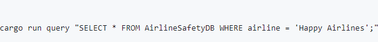

### Goal
This project aims to deliver a comprehensive ETL (Extract, Transform, Load) tool with querying capabilities, all developed using the Rust programming language. The process involves setting up a new Rust project using cargo init, installing Rust dependencies via Cargo.toml using cargo build, and leveraging Github Copilot for translating Python code to Rust. The translation process is carefully executed to ensure compliance with Rust's syntax, robust error handling, and full utilization of Rust's unique features.

The toolkit provides a set of functions for performing ETL operations on datasets, allowing for queries on a SQLite database. It covers CRUD (Create, Read, Update, Delete) operations and logs all queries to a Markdown file named query_log.md for tracking and analysis of executed commands.

The workflow includes tasks performed using a Makefile, such as installation, testing, code formatting, and linting. This automation streamlines the data analysis process and improves code quality.

## Operations Example:
I have read the data 

I have performed the Delete operation on the data :

As a final step, the project produces an optimized Rust binary, available as a GitHub Actions artifact for download.

### Workflow Overview
The project's workflow can be summarized as follows:

### Rust Initiation and Dependencies Installation: 
This involves initializing a new Rust project using cargo init, which creates the necessary project files, including Cargo.toml, and installing Rust dependencies using cargo build.

### Github Copilot Translation from Python to Rust:
The project leverages Github Copilot to translate Python code into Rust, ensuring the correct use of Rust syntax, effective error handling, and the implementation of Rust's unique features.

### ETL-Query: This phase includes four main actions-
Extract, Transform, Load, and Query. The Extract function downloads data from a specified URL and saves it locally. The Transform and Load function reads a CSV dataset, performs necessary table operations, and inserts records into a SQLite database. The Query function allows the execution of SQL queries on the database for data analysis and retrieval.

## Preparation
Before starting the project, the author forked the rust-new-project-template and selected the Airline Safety dataset from GitHub as the data source.

## Dataset Background
The chosen dataset, airline-safety.csv, originates from the Aviation Safety Network and consolidates safety-related information for 56 airlines in a CSV format. It includes data on weekly available seat kilometers and details of incidents, fatal accidents, and fatalities during two time periods: 1985-1999 and 2000-2014.

## Project Description
The project's steps are as follows:

Rust Initiation: Initialize a new Rust project using cargo init, which sets up project files and directories.

Rust Dependencies Installation: Specify project metadata and dependencies in Cargo.toml.

Github Copilot Translation: Translate Python code to Rust for the core functionality.

CLI Implementation: Create a command-line interface (CLI) in main.rs for users to perform ETL and querying actions on the dataset.

Makefile Automation: The Makefile includes custom tasks for database-related actions, such as data extraction, transformation and loading, creating, reading, updating, and deleting records.

The Makefile tasks enable automated development, testing, and management of the Rust project.

